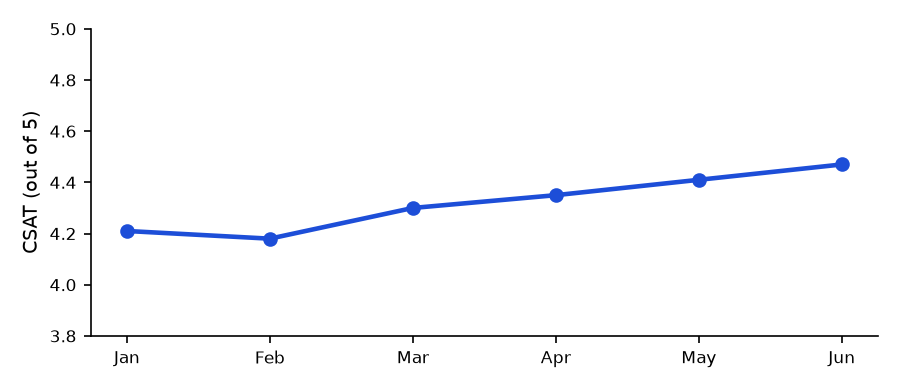

# Summary

Ticket volume grew 9% month-over-month, in line with the new-customer
cohort from May, but average resolution time improved to 4.1 hours (down
from 5.3 hours in January) thanks to the macro library shipped in April.
Customer satisfaction (CSAT) climbed for the fifth consecutive month.

> **CSAT hit a new high of 4.47/5 in June.** The macro library and the
> revised first-response templates are the two changes support leadership
> credits most directly — both shipped in April, and the CSAT trend
> inflects right around that point.

# CSAT Trend

# Ticket Volume by Channel

| Channel | Tickets | Avg. resolution | CSAT |
|---|---:|---:|---:|
| Email | 2,140 | 5.2h | 4.31 |
| Chat | 3,680 | 2.1h | 4.58 |
| Phone | 890 | 8.4h | 4.22 |
| Community forum | 410 | 12.6h | 4.09 |

> **Community forum is the outlier.** 12.6h average resolution is more
> than double any other channel — largely because it's staffed part-time
> by two engineers rotating off their primary team. Support Ops has a
> proposal to add a dedicated part-time community moderator in Q3.

# Notes for Next Month

- Chat continues to be both the highest-volume and highest-CSAT channel —
  worth understanding *why* before assuming it will hold as volume grows.
- Phone resolution time is trending up slightly (7.6h to 8.4h over three
  months); worth a closer look before it becomes a trend worth flagging.
- The community forum staffing proposal goes to the Q3 planning review.
